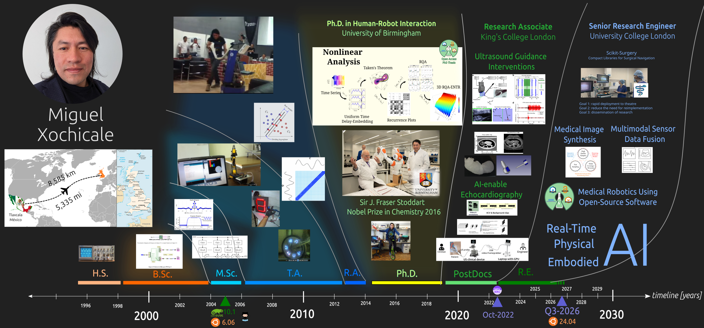
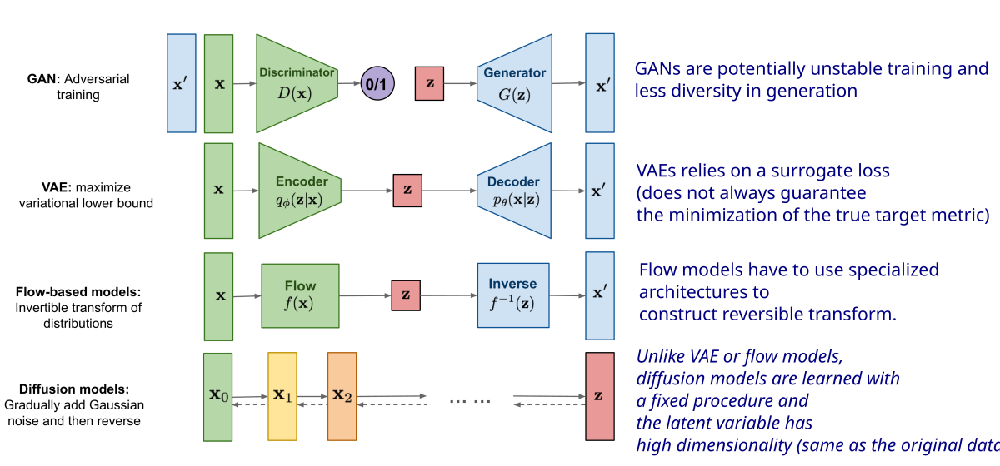
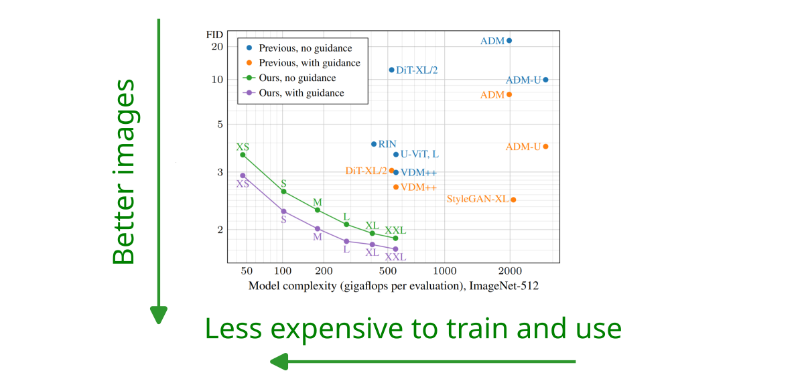
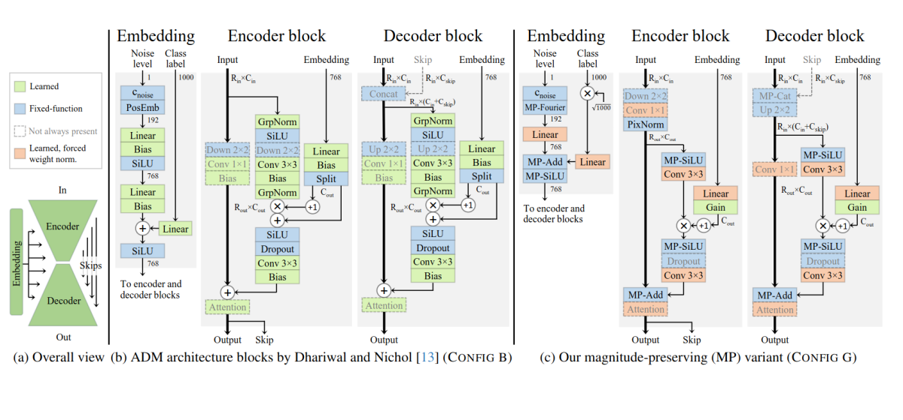
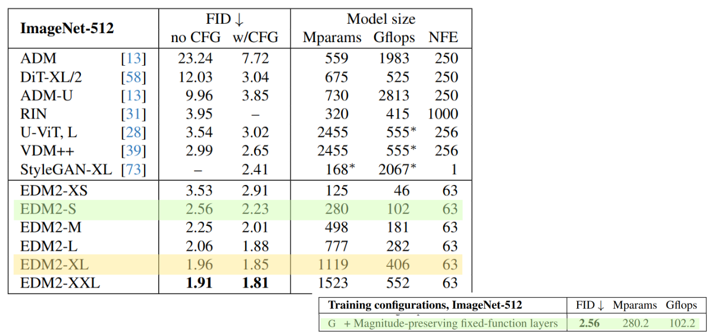
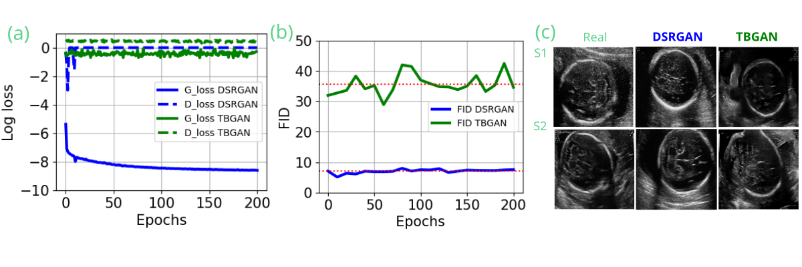
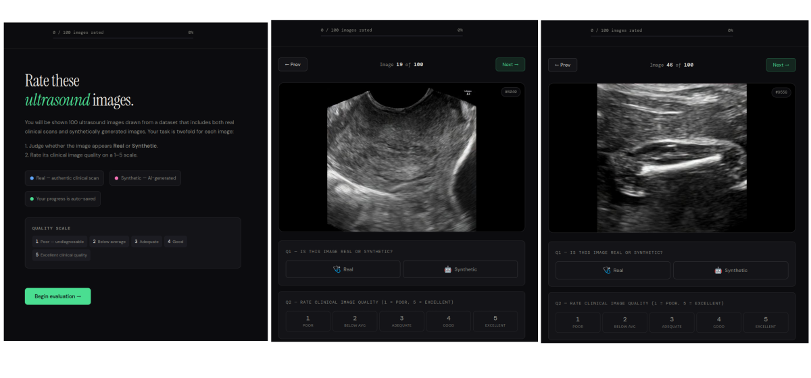
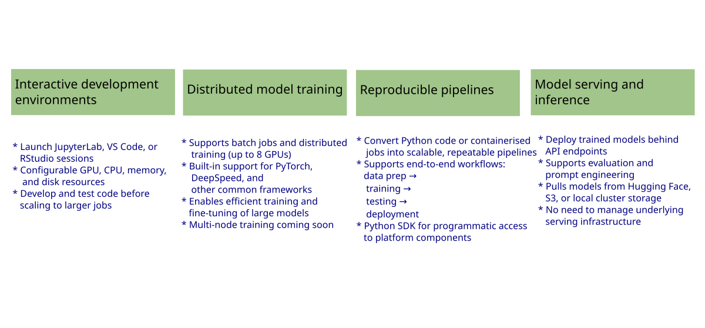
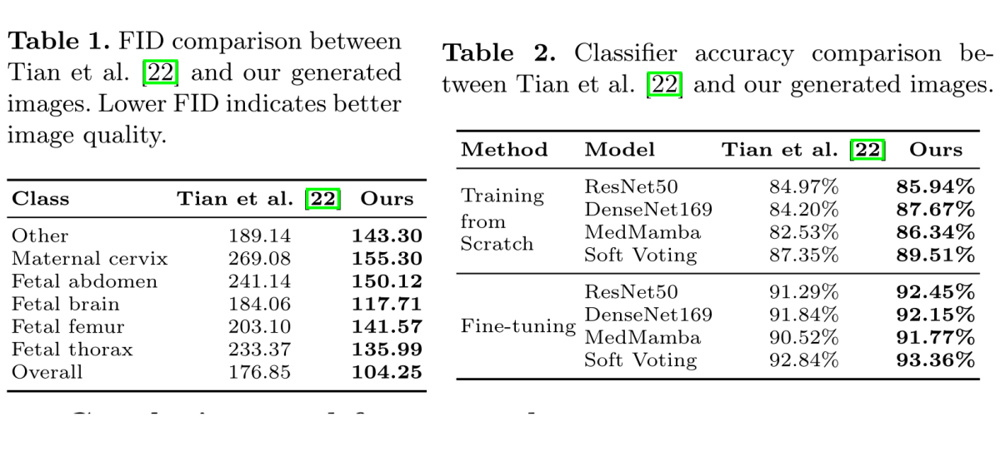

Miguel Xochicale

# 

<div style="background-color: rgba(22,22,22,0.75);   border-radius: 10px;   text-align:center;   padding: 0px;   padding-left: 1.5em;   padding-right: 1.5em;   max-width: max-content;   margin-left: auto;   margin-right: auto;   padding-top: 0.2em;   padding-bottom: 0.2em;   line-height: 1.5em!important;">

<span style="color:#939393; font-size:1.75em; text-align:left; display:block;">

<!-- TODO: replace with the real talk title -->

<span style="color:#e0e0e0; font-size:1.65em; display:block; font-weight:600;">Foundation
Diffusion Model with Open-Source Medical Imaging in Unified-AI</span>

</span>

------------------------------------------------------------------------

<span style="font-size:0.55em; color:#aaaaaa;">[**Miguel Xochicale (
@mxochicale)** ](https://github.com/mxochicale), Senior RSE,
[UCL-ARC](https://www.ucl.ac.uk/advanced-research-computing/)</span>

</div>

<div class="footer">

<span class="dim-text" style="text-align:left;">Q1-2026 [(web-animations
2025 by
mxochicale)](https://mxochicale.github.io/web-animations/)</span>

</div>

<div class="notes">

<!-- TODO: add opening speaker notes -->

</div>

<!-- ============================================================
     OVERVIEW
     ============================================================ -->

## Overview

<div class="columns">

<div class="column" width="50%">

<!-- TODO: link items 3-4 to real slide anchors once those sections exist,
     e.g. add `{#sectag_demos}` / `{#sectag_future}` to their section headers -->

- [My journey](#secMJ)
- [Prenatal ultrasound (US) Imaging](#secUS) <add details>
- [EDM2 diffusion model](#secDM) <add details>
- [Image Quality Assessment](#secIQ) <add details>
- [Unified AI](#secUAI) <add details>
- [Results](#secR) <add details>
- [Conclusions and Future Work](#secCFW) <add details>

</div>

<div class="column" width="50%">

</div>

</div>

<div class="notes">

<!-- TODO: add key themes -->

### What We’ll Cover

### Key Themes

<!-- TODO: replace placeholder keywords -->

> [!NOTE]
>
> ### :cloud: Cloud keywords
>
> keyword1, keyword2, keyword3

> [!TIP]
>
> ### :robot: Robotics keywords
>
> keyword1, keyword2, keyword3

> [!IMPORTANT]
>
> ### :busts_in_silhouette: Collaborative keywords
>
> keyword1, keyword2, keyword3

</div>

<!-- *********************** NEW SLIDE *********************** -->

## My Journey



<div class="notes">

To update figure go to:
https://github.com/mxochicale/cv/tree/main/my-journey

</div>

<!-- ============================================================
     SECTION: Section 1
     ============================================================ -->

# Prenatal ultrasound (US) Imaging

**Add Subtitle**

<div class="notes">

<!-- TODO: notes specific to Section title 1 -->

Walk through the three layers: cloud VMs managed via Terraform/k8s, the
campus network, and physical hardware (sensors, robots).

</div>

<!-- *********************** NEW SLIDE *********************** -->

##  Github: Getting started docs

<div id="fig-template-section1">


Figure 1: Getting started documentation provide with a range of links to
setup, use, run and debug application including github workflow.

</div>

<div class="notes">

Speaker notes go here.

</div>

<!-- ============================================================
     SECTION: Section 2
     ============================================================ -->

# EDM2 diffusion model

Elucidating the Design Space of Diffusion Models, version 2\
Harvey Mannering and Zhiwu Huang at University of Southampton

<div class="notes">

<!-- TODO: notes specific to Section title 1 -->

Gigaflops per evaluation measures computational efficiency by tracking
how many billions of floating-point math calculations (gigaflops) a
computer processor uses to test, score, or run a single trial
(evaluation) in an algorithm or model.

</div>

<!-- *********************** NEW SLIDE *********************** -->

## What Are Diffusion Models?

<div id="fig-template-section1">



Figure 2: Overview of different types of generative models. (Source:
[Lil’Log](https://lilianweng.github.io/posts/2021-07-11-diffusion-models/))

</div>

<div class="notes">

Speaker notes go here.

https://lilianweng.github.io/posts/2021-07-11-diffusion-models/
https://toloka.ai/blog/unveiling-the-dynamics/

</div>

<!-- *********************** NEW SLIDE *********************** -->

## EDM2: Record quality at fraction of training time

<div id="fig-template-section1">



Figure 3: Figure 1 from Kerras et al. 2024 in CVPR.

</div>

<div class="notes">

Speaker notes go here.

PAPER: https://arxiv.org/pdf/2312.02696 POSTER:
https://cvpr.thecvf.com/virtual/2024/poster/31235

</div>

<!-- *********************** NEW SLIDE *********************** -->

## EDM2 Architecture

<div id="fig-template-section1">



Figure 4: Figure 2 EDM2 Architecture combines a U-Net with
self-attention layers (Kerras et al. 2024 in CVPR).

</div>

<div class="notes">

Speaker notes go here.

PAPER: https://arxiv.org/pdf/2312.02696 POSTER:
https://cvpr.thecvf.com/virtual/2024/poster/31235

</div>

<!-- *********************** NEW SLIDE *********************** -->

## EDM2 Results

<div id="fig-template-section1">



Figure 5: Table 2. Results on ImageNet-512. “EDM2-S” is the same as
CONFIG G in Table 1 (Kerras et al. 2024 in CVPR).

</div>

<div class="notes">

Speaker notes go here.

PAPER: https://arxiv.org/pdf/2312.02696 POSTER:
https://cvpr.thecvf.com/virtual/2024/poster/31235

TODO

- OUR PAPER We train two different sized networks, EDM2-S and EDM2-XL,
  which allows us to apply autoguidance \[14\] to improve image quality.

- KERAS2024: In our tests, the smallest (XS) unconditional model was
  found to be sufficient for guiding even the largest (XXL) conditional
  model — using a larger unconditional model did not improve the results
  at all.

</div>

<!-- ============================================================
     SECTION: Section 3
     ============================================================ -->

# Image Quality Assessment

<div class="notes">

<!-- TODO: notes specific to Section 3-->

</div>

<!-- *********************** NEW SLIDE *********************** -->

## Fréchet Inception Distance (FID) Score

- Quaility of synthesised images are evaluated with Frechet inception
  distance (FID), measuring the distance between distributions of
  synthetised and original images (Heusel et al., 2017).
- The lower the FID number is, the more similar the synthetised images
  are to the original ones. FID metric showed to work well with fetal
  head US compared to other metrics (Bautista et al., 2012).

<div id="fig-bautista2023_fig1">



Figure 6: Table 2. Results from Diffusion-Super-resolution-GAN (DSR-GAN)
and transformer- based-GAN (TB-GAN): (Bautista et al. 2023 in MIDL).

</div>

<div style="font-size: 55%;">

**Heusel et al. 2017** in NIPS’17
<https://dl.acm.org/doi/10.5555/3295222.3295408> **Bautista et
al. 2023** in MIDL <https://github.com/xfetus/midl2023>

</div>

<div class="notes">

Notes go here

</div>

<!-- *********************** NEW SLIDE *********************** -->

## Clinical evaluation

- Q1. Is this image real or synthetic?
- Q2. Rate clinical image quality (1 = poor, 5 = excellent)

<div id="fig-bautista2023_fig1">



Figure 7: Survey
<https://xfetus.github.io/fetal-ultrasound-edm2-survey-2026>

</div>

<div style="font-size: 55%;">

**Mannering et al. 2026** in MIUA’26
<https://xfetus.github.io/fetal-ultrasound-edm2-survey-2026>

</div>

<div class="notes">

Notes go here

</div>

<!-- ============================================================
     SECTION: Section 4
     ============================================================ -->

# Unified AI

**Unified AI Platform for Research with Kubernetes**

<div class="notes">

<!-- TODO: notes specific to Section 4 -->

https://github.com/xfetus/fetal-ultrasound-edm2/tree/main/unified-ai

https://huggingface.co/harveymannering/ultrasound-edm2

docs https://test-mintlify.mintlify.site/use-cases/edm2-diffusion

</div>

<!-- *********************** NEW SLIDE *********************** -->

## Unified AI Platform for Research

Scalable, GPU-accelerated infrastructure enabling UCL researchers to
develop, train, evaluate, and deploy AI and machine learning models.

<div id="fig-template-section1">



Figure 8: Unified AI Platform

</div>

<div style="font-size: 55%;">

An overview of Kubeflow Trainer:
<https://www.ucl.ac.uk/advanced-research-computing/platforms-services/unified-ai-platform-research/>

</div>

<div class="notes">

</div>

<!-- *********************** NEW SLIDE *********************** -->

## UAI: Kubeflow Trainer capabilities

<div id="fig-template-section1">


Figure 9: User Personas in Kubeflow Trainer

</div>

<div style="font-size: 55%;">

An overview of Kubeflow Trainer:
<https://www.kubeflow.org/docs/components/trainer/overview/>

</div>

<div class="notes">

</div>

<!-- *********************** NEW SLIDE *********************** -->

## UAI: GitHub Container Registry

<div id="fig-template-section1">


Figure 10: Worflow for GitHub Container Registry

</div>

<div style="font-size: 55%;">

An overview of Kubeflow Trainer:
<https://www.kubeflow.org/docs/components/trainer/overview/>

</div>

<div class="notes">

</div>

<!-- *********************** NEW SLIDE *********************** -->

## Dockerfiles

<div class="panel-tabset">

### Dockerfile -\>

<div class="code-with-filename">

**Dockerfile**

``` python

# syntax=docker/dockerfile:1.7
FROM docker.io/pytorch/pytorch:2.9.1-cuda12.8-cudnn9-devel

RUN mkdir -p /workspace && chmod -R 777 /workspace
WORKDIR /workspace

COPY requirements.txt .

RUN /opt/conda/bin/python -m pip install --upgrade pip && \
    /opt/conda/bin/python -m pip install --no-cache-dir -r requirements.txt

COPY . .

CMD ["/opt/conda/bin/python"]
```

</div>

### \<- requirements.txt

<div class="code-with-filename">

**requirements.txt**

``` python

# core dependencies
pillow
loguru
notebook
numpy
omegaconf
pandas
pyyaml
wandb

# test dependencies
black
codespell
detect-secrets
isort
pre-commit
pylint
pytest

# learning dependencies
accelerate
basicsr
diffusers
einops
scikit-learn
torch
torchvision
```

</div>

### Dockerfile-scratch-volume

<div class="code-with-filename">

**Dockerfile-scratch-volume**

``` python

# syntax=docker/dockerfile:1.7
FROM docker.io/pytorch/pytorch:2.9.1-cuda12.8-cudnn9-devel

RUN mkdir -p /workspace && chmod -R 777 /workspace
RUN mkdir -p /.cache/pip /.local && chmod -R 777 /.cache/pip /.local

WORKDIR /workspace
```

</div>

</div>

<div class="notes">

Speaker notes go here. {.scrollable}

</div>

<!-- *********************** NEW SLIDE *********************** -->

## Training EDM2 Model (kubeflow 0.3.0)

<div class="panel-tabset">

### training-edm2-model-ghcr

<div class="code-with-filename">

**training-edm2-model-ghcr.ipynb**

``` python

# https://github.com/xfetus/fetal-ultrasound-edm2/blob/main/unified-ai/training-edm2-model-ghcr.ipynb

## Set how many PyTorch nodes you want to use for distributed training.
NUM_NODES = 1

# Set the resources for each PyTorch node.
RESOURCES_PER_NODE = {
    "cpu": "4",           # CPUs per node
    "memory": "64Gi",     # Memory in GiB per node (tried 2Gi CrashLoopBackOff/OOMKilled), 64Gi works
    "nvidia.com/gpu": 1,  # GPUs per node (the number will depend on the available resources)
}

GITHUB_CONTAINER_REGISTRY = "ghcr.io/xfetus/fetal-ultrasound-edm2/fetal-ultrasound-edm2-distributed-learning:v0.1.1"

command = TrainerCommand(
    command=[
        "torchrun",
        f"--nnodes={NUM_NODES}",
        "train_edm2.py", #path of script in scratch 
        "--outdir", "/scratch-volume/FETAL_PLANES_DB/OUTPUT_DIRECTORY", # pragma: allowlist secret
        "--data", "/scratch-volume/FETAL_PLANES_DB", # pragma: allowlist secret
        "--batch", "4",
        "--preset", "edm2-img512-s",
        "--batch-gpu", "4",
    ]
)


job_id = trainer.train(
    runtime=torch_runtime,
    trainer=CustomTrainerContainer(
        image=GITHUB_CONTAINER_REGISTRY,
        num_nodes=NUM_NODES,
        resources_per_node=RESOURCES_PER_NODE,
        env=ENV_VARS        
    ),
    options=[command, pod_template_overrides],
)

```

</div>

### training-edm2-model-scratch-volume

<div class="code-with-filename">

**training-edm2-model-scratch-volume.ipynb**

``` python

# https://github.com/xfetus/fetal-ultrasound-edm2/blob/main/unified-ai/training-edm2-model-scratch-volume.ipynb


## Set how many PyTorch nodes you want to use for distributed training.
NUM_NODES = 1

# Set the resources for each PyTorch node.
RESOURCES_PER_NODE = {
    "cpu": "4",           # CPUs per node
    "memory": "64Gi",     # Memory in GiB per node (tried 2Gi CrashLoopBackOff/OOMKilled), 64Gi works
    "nvidia.com/gpu": 1,  # GPUs per node (the number will depend on the available resources)
}

GITHUB_CONTAINER_REGISTRY = "ghcr.io/xfetus/fetal-ultrasound-edm2/fetal-ultrasound-edm2-distributed-learning:v0.0.1"
# VERSION_ID=v0.0.1 #FROM docker.io/pytorch/pytorch:2.9.1-cuda12.8-cudnn9-devel / RUN mkdir -p /workspace && chmod -R 777 /workspace 
#                    RUN mkdir -p /.cache/pip /.local && chmod -R 777 /.cache/pip /.local


command = TrainerCommand(
    command=[
        "bash", "-c",
        (
            # Create writable dirs
            "mkdir -p /scratch-volume/pip-packages "
            "/scratch-volume/torch-inductor-cache "
            "/scratch-volume/home && "
            # Install deps exclude torch/torchvision (already in base image)
            # Use --upgrade to overwrite stale packages from previous runs
            "pip install "
            "pandas "
            "accelerate "
            "basicsr "
            "diffusers "
            "einops "
            "scikit-learn "
            "--target=/scratch-volume/pip-packages "
            "--upgrade "
            "--no-cache-dir "
            "--quiet && "
            # Set cache env vars inline to guarantee they're set before torchrun
            "export HOME=/scratch-volume/home && "
            "export TORCHINDUCTOR_CACHE_DIR=/scratch-volume/torch-inductor-cache && "
            "export PYTHONPATH=/scratch-volume/pip-packages:$PYTHONPATH && "          
            "torchrun /scratch-volume/fetal-ultrasound-edm2/train_edm2.py "
            "--outdir /scratch-volume/FETAL_PLANES_DB/OUTPUT_DIRECTORY "
            "--data /scratch-volume/FETAL_PLANES_DB "
            "--batch 4 "
            "--preset edm2-img512-s "
            "--batch-gpu 4"
        )
    ]
)


job_id = trainer.train(
    runtime=torch_runtime,
    trainer=CustomTrainerContainer(
        image=GITHUB_CONTAINER_REGISTRY,
        num_nodes=NUM_NODES,
        resources_per_node=RESOURCES_PER_NODE,
        env=ENV_VARS        
    ),
    options=[command, pod_template_overrides],
)

```

</div>

</div>

<div style="font-size: 55%;">

Jupyter Notebooks:
<https://github.com/xfetus/fetal-ultrasound-edm2/blob/main/unified-ai/training-edm2-model-ghcr.ipynb>\
<https://github.com/xfetus/fetal-ultrasound-edm2/blob/main/unified-ai/training-edm2-model-scratch-volume.ipynb>

</div>

<div class="notes">

Speaker notes go here. {.scrollable}

</div>

<!-- ============================================================
     SECTION: Section 6
     ============================================================ -->

# Results

Yilin Zhang at University of Southampton\
Ziao Liu at Tsinghua University\
Jacqueline Matthew at King’s College London

Published in **Medical Image Understanding and Analysis Conference
(MIUA)**

<div class="notes">

<!-- TODO: notes specific to Section 6  -->

</div>

<!-- *********************** NEW SLIDE *********************** -->

## Diffusion-based synthesis (512×512)

<div id="fig-template-section2">


Figure 11: Representative fetal ultrasound images from real data, Tian
et al. \[22\], and our proposed high-resolution (512×512)
diffusion-based synthesis approach.

</div>

<div style="font-size: 55%;">

**Mannering et al. 2026** in MIUA 2026 (TBC: arxiv and conference
proceedings)

</div>

<div class="notes">

Speaker notes go here.

</div>

<!-- *********************** NEW SLIDE *********************** -->

## FID and Classifier accuracy comparison

<div id="fig-template-section2">



Figure 12: FID and Classifier accuracy comparison between Tian et
al. \[22\] and our generated images.

</div>

<div style="font-size: 55%;">

**Mannering et al. 2026** in MIUA 2026 (TBC: arxiv and conference
proceedings)

</div>

<div class="notes">

Speaker notes go here.

</div>

<!-- *********************** NEW SLIDE *********************** -->

## Clinical evaluation by an experienced fetal ultrasound specialist (10+ years)

- CLinitian evaluated 100 generated images, distinguishing real from
  synthetic and rating quality on a 5-point Likert scale.
- The mean score was 2.67, with real images scoring higher (3.12) than
  synthetic ones (2.07).
- Judgement relied on subtle artefacts including smoothing, speckle
  patterns, and anatomical inconsistencies.

<div id="fig-template-section2">


Figure 13: 100 images yielded a mean realism score of 2.67/5, with real
images rated higher than synthetic. Artefacts included smoothing,
speckle irregularities, and anatomical inconsistencies.

</div>

<div style="font-size: 55%;">

**Mannering et al. 2026** in MIUA 2026 (TBC: arxiv and conference
proceedings)

</div>

<div class="notes">

Speaker notes go here.

</div>

<!-- ============================================================
     SECTION: Section 6
     ============================================================ -->

# Conclusions and future work

<div class="notes">

<!-- TODO: notes specific to Section 6 -->

</div>

<!-- *********************** NEW SLIDE *********************** -->

## Key Takeaways

<div style="font-size: 90%;">

<div class="incremental">

- 💻 **Unified AI Platform**\
  Notebook namespaces with scratch volumes worked well for prototyping
  and debugging models with `CustomTrainerContainer()`.
- 🩻 **EDM2 Diffusion Model**\
  Prototyped locally on a single GPU (NVIDIA RTX 2000, 8GB), then scaled
  via a distributed training pipeline on the Unified AI platform. The
  resulting model generates 512×512 fetal ultrasound images — surpassing
  prior 256×256 approaches — trained entirely on open datasets, and
  improves downstream classification performance.
- 📝 **Submitting to MIUA 2026**\
  Short paper (3 pages) submitted and accepted. Timeline. Call: early
  April 2026; Deadline: May 20, 2026; Notification & camera-ready: early
  June 2026; Conference: mid-July 2026.
- 📦 **Open Release & Future Work**\
  All code and models released publicly. Next steps: scaling toward
  foundation models for low-resource healthcare settings, and further
  comparison of diffusion architectures.

</div>

</div>

<div class="notes">

</div>

todo

<!-- *********************** NEW SLIDE *********************** -->

## Future work

<div style="font-size: 90%;">

<div class="incremental">

- 💻 **Up kubeflow 0.4.0 in the Unified AI Platform**\
  Move EDM2 training onto Kubeflow 0.4.0, with updated scratch-volume
  mounting, a step toward a reusable, distributed pipeline for training
  scalable foundation models in low-resource healthcare settings.

- 📝 **Publish and Formalize the Work**\
  Release an arXiv preprint of the short paper with its additional
  material and pursue official publication in the MIUA 2026 conference
  proceedings, establishing a citable reference point for the model and
  open-source release.

- 📦 **Grow the Collaboration Network for ARC**\
  Share the presentation, paper, arXiv preprint, and GitHub repository
  to open discussion with clinicians and researchers, inviting
  collaboration on further diffusion-architecture comparisons for
  medical images and extensions to other low-resource imaging domains.

</div>

</div>

<div class="notes">

</div>

<!-- ============================================================
     EXTRA SLIDES (appendix)
     ============================================================ -->

# Appendix

Extra slides for Q&A

<!-- *********************** NEW SLIDE *********************** -->

## Title of the slide

- Bullet point 1
- Bullet point 2
- **Bullet point** 3
  - Bullet point 3.1
  - Bullet point 3.2

<div style="font-size: 55%;">

**Sciortino et al. 2017** in Computers in Biology and Medicine
<https://doi.org/10.1016/j.compbiomed.2017.01.008> **He et al. 2021** in
Front. Med. <https://doi.org/10.3389/fmed.2021.729978>

</div>

<div class="notes">

Notes go here

</div>

<!-- *********************** NEW SLIDE *********************** -->

##  Github: Getting started docs

<div id="fig-template-section1">


Figure 14: Getting started documentation provide with a range of links
to setup, use, run and debug application including github workflow.

</div>

<div style="font-size: 55%;">

**Sciortino et al. 2017** in Computers in Biology and Medicine
<https://doi.org/10.1016/j.compbiomed.2017.01.008> **He et al. 2021** in
Front. Med. <https://doi.org/10.3389/fmed.2021.729978>

</div>

<div class="notes">

Speaker notes go here.

</div>
